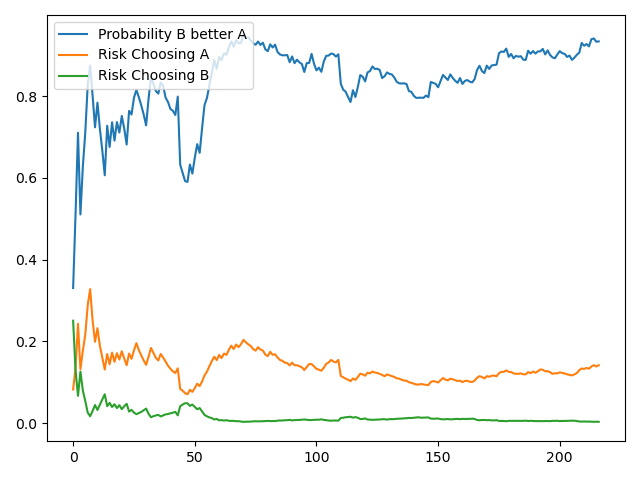

 # **Website A/B testing**

## 1. Introduction
This is an A/B testing project that was made to see if a new version of a sign up button in a website is better than current one. This A/B testing was made using a reinforcement learning algorithm called Multi-Bandit Armed (MAB) with a bayesian agent (Thompson Sampling).

# 2. Business Problem.

iSketch company designs a software that makes 3D prototype projects for civil construction. This software is a Software as a Service (SaaS) and to use it you need to get an annual subscription.

One of the best ways of acquiring customers is getting their e-mail when they signing up company weakly newsletter about civil construction and 3D protoypes.

Therefore, improve conversion rate of website that capture customer e-mails is very important to ramp up number of customers.

A new design for the website was made with the sign up button in a different color in order to increase conversion rate. The new sign up button would be red and actual one is blue.

The marketing team would like to see if new design has a conversion rate better than current one. However, they do not have much time to collect data over many days to test which design is better.

# 3. Business Assumptions.

* Conversion rate would be related to number of clicks in sign up button. That would be number of sign up clicks (success) divided by total number of visits

* A customer just can see one of the pages

# 4. Tools used
* Python
* Jupyter Notebook
* Git and Github
* VS Code
* Flask
* HTML
* Multi-armed bandit with a Bayesian Approach (Thompson Agent)

# 5. Dataset

Dataset was generated by using a webscrapper (robot) that simulates customer behavior in both websites. The webscrapper simulates 200 customers accessing website and randomly click or not in sign up button based on some probabilities threshold. The columns in dataset are the following:

* visit - assign value of 1 for each row/customer
* click - Customer click in sign up button (0 for no and 1 for yes)
* no_click - Difference between visit - click (0 for yes and 1 for no)
* group - Assign value of 'control' if customer see current website design (blue sign up button) and 'treatment' (red sign up button) for those who see new one

# 6. Solution Strategy

THe strategy to solve this was:

* Design what type of test will be used (Multi-Armed Bandit with Thompson agent)
* Choose of metric of interest
* Definition of posteriori distribution (beta-binomial distribution)
* Definition of priori distribution (beta distribution)
* Define maximum accepted loss ( 5% )
* Design test infrastructure (define endpoint, API, two websites, agent)
* Design two 'fake' websites with different buttons colors
* Create an API in flask to run websites
* Create a webscrapper
* Getting data
* Calculate probability of page B be better than page A

Two websites was created to simulate scenarios with control and treatment design. They were interchangeable, which means that both designs were shown at same period of time to the customers. It was define that if control website is shown, the probability of customer click in sign up button is 0.3 (conversion rate is 30%). If treatment website is shown, probability is 0.35 (conversion rate is 35%). 

At first, both websites would have approximately same probability of be rendered to the customer. However, as more customers use both websites, agent would recognize which page has a greater conversion rate and gradually the best page would be shown more to customers. When the probability that page defined as better by agent is actually not is below 0.05 (maximum accepted loss of 5%), test is concluded and the best design is chosen

# 7. Reinforcement Learning and Multi-Armed Bandit (MAB)

Reinforcement Learning is a machine learning method that uses an agent that takes actions in order to maximize the reward getting when it does some desired behavior and minimize the punishment for undesired one. It learns through trial and error using feedback from its own actions in an interactive environment.

Multi-Armed bandit is a type of reinforcement learning where an agent try to detect the option that maximizes its expected reward in a long run. At first, agent does not know which choice would give it the best reward and it allocates resources between competing choices. As time passes, agent can discover which option is better and it will put more recourses in that option and decrease recourses of other ones. 

For instance, in a situation that it needs to see which website has best conversion rates among 3 different designs, it will allocates theses designs randomly at first and check which one is better. After some time, it discovers that one of them would have a greater conversion rate and starts to show more just that design, maximizing this metric.

The agent chosen is a Thompson Sampling, which is a bayesian agent. This agent would have a beta-binomial probability distribution as posteriori.

# 8. A/B testing Results

In plot below it is possible to see that the probability of treatment page being better than control page stay stable and above 80% from 70 customers. Also, the risk of choosing treatment page when control is better is almost 0. The agent learn this quickly and started to show more page B to customers. It shows page B for 180 customers and page A for 20 customers, increasing conversion rate of sign ups.

# 9. Business Results

Considering the following scenario:

* Subscription price of this software is $1000
* Percentage of customers that signing up the newsletter and, after that, get a subscription is 10%.
* In a month, around 10000 leads access website which captures e-mails.

If conversion rate increases from 30% to 35%, it will get approximately more 500 e-mails. In this 500 possible customers, around 50 will acquire annual subscription, which will turn into $50,000 in revenue each month and $600,000 in a year.

# 10. Conclusions

The MAB agent did a good job in selecting that new design has a conversion rate better than the current one in a shorter time compared to classical A/B testing, which needs much more time to collect data and draw conclusions. 